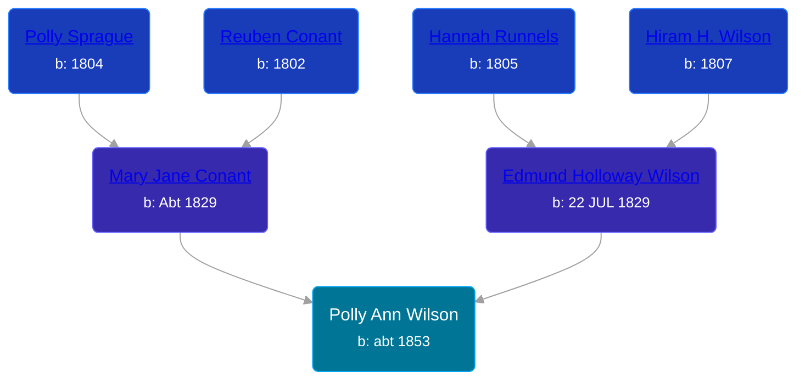

## 🟣 Polly Ann Wilson
<small>Age: 46y, 7m, 19d</small>

Daughter of [Edmund Holloway Wilson](/people/6/67777324) and [Mary Jane Conant](/people/2/27722232)





### 📆 Events


Type | Date | Age at Event | Place
------ | ------ | ------ | ------
Birth | abt 1853 |  | Wayne, New York, USA
[Residence](#event-event-0) | 1860 | 7y | Butler, Wayne, New York, USA
[Residence](#event-event-1) | 1870 | 17y | Allendale, Ottawa, Michigan, USA
[Residence](#event-event-2) | 1880 | 27y | Robinson Township, Ottawa, Michigan, USA
[Death](#event-event-6) | 19 JUL 1899 | 46y, 7m, 19d | Big Rapids, Mecosta, Michigan, USA



- **Birth**
**Date**: abt 1853, Age:
**Place**: Wayne, New York, USA
- **[Residence](#event-event-0)**
**Date**: 1860, Age: 7y
**Place**: Butler, Wayne, New York, USA
- **[Residence](#event-event-1)**
**Date**: 1870, Age: 17y
**Place**: Allendale, Ottawa, Michigan, USA
- **[Residence](#event-event-2)**
**Date**: 1880, Age: 27y
**Place**: Robinson Township, Ottawa, Michigan, USA
- **[Death](#event-event-6)**
**Date**: 19 JUL 1899, Age: 46y, 7m, 19d
**Place**: Big Rapids, Mecosta, Michigan, USA


## 👩‍❤️‍👨 Relationships

### 🔵 [Charles E. Gregory](/people/9/98443628), b. abt 1843

#### Events


Type | Date | Age at Event | Place
------ | ------ | ------ | ------
[Marriage](#event-family-0-event-0) | 05 JUL 1870 | 17y, 7m, 5d | Allendale, Ottawa, Michigan, USA



- **[Marriage](#event-family-0-event-0)**
**Date**: 05 JUL 1870, Age: 17y, 7m, 5d
**Place**: Allendale, Ottawa, Michigan, USA


### 📰 Event Sources

####  Residence, 1860
* 1860 US Census

####  Residence, 1870
* 1870 US Census

####  Marriage, 05 JUL 1870
* Michigan, Marriage Records, 1867-1952
>   
  > Name:Polly Ann Wilson  
  > Gender:Female  
  > Birth Year:abt 1854  
  > Birth Place:Wayne County, New York  
  > Marriage Date:5 Jul 1870  
  > Marriage Place:Allendale, Ottawa, Michigan, USA  
  > Age:16  
  > Residence Place:Allendale, Michigan  
  > Spouse:Charles E Gregery  
  > Spouse Gender:Male  
  > Spouse Age:23  
  > Spouse Birth Place:Hillsdale, Michigan  
  > Spouse Residence Place:Allendale, Michigan  
  > Record Number:148  
  > Film:5  
  > Film Description:1870 Monroe - 1871 Jackson

####  Residence, 1880
* 1880 US Census

####  Death, 19 JUL 1899
* Michigan, Deaths and Burials Index, 1867-1995
>   
  > Name: Anna Gregary  
  > [Anna Wilson]  
  > Birth Date: abt 1853  
  > Birth Place: New York  
  > Death Date: 19 Jul 1899  
  > Death Place: Big Rapids, Mecosta, Michigan  
  > Death Age: 46  
  > Occupation: Housewife  
  > Race: White  
  > Marital Status: Married  
  > Gender: Female  
  > Father Name: Egurid Wilson  
  > Mother Name: Mary Conant  
  > FHL Film Number: 1004850
* Michigan, Death Records, 1867-1950
>   
  > Name: Annie Gregory  
  > Birth Year: abt 1853  
  > Death Date: 19 Jul 1899  
  > Death Place: Big Rapids, Mecosta, Michigan, USA  
  > Age: 46  
  > Father's Name: Egmund Wilson