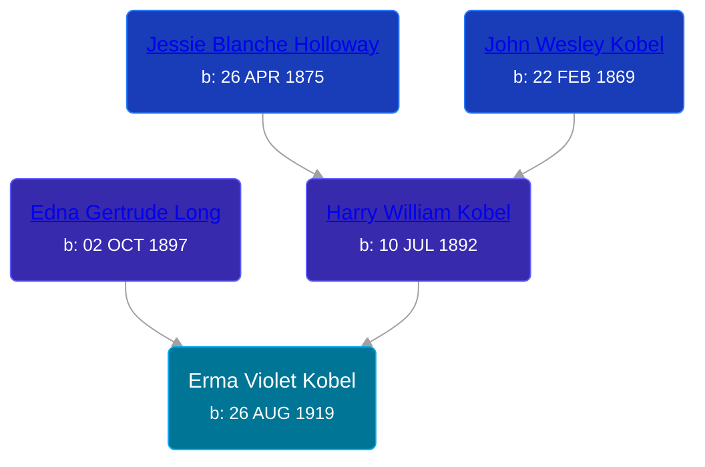

## 🟣 Erma Violet Kobel
<small>Age: 74y, 3m, 20d</small>

Daughter of [Harry William Kobel](/people/3/30496161) and [Edna Gertrude Long](/people/3/33710863)





### 📆 Events


Type | Date | Age at Event | Place
------ | ------ | ------ | ------
[Birth](#event-event-2) | 26 AUG 1919 |  | Elmira Township, Antrim, Michigan, USA
[Residence](#event-event-0) | 08 JAN 1920 | 4m, 12d | Warner Township, Antrim, Michigan, USA
[Residence](#event-event-1) | 05 APR 1930 | 10y, 7m, 9d | Chestonia Township, Antrim, Michigan, USA
Death | 16 DEC 1993 | 74y, 3m, 20d | Clare, Clare County, Michigan, United States



- **[Birth](#event-event-2)**
**Date**: 26 AUG 1919, Age:
**Place**: Elmira Township, Antrim, Michigan, USA
- **[Residence](#event-event-0)**
**Date**: 08 JAN 1920, Age: 4m, 12d
**Place**: Warner Township, Antrim, Michigan, USA
- **[Residence](#event-event-1)**
**Date**: 05 APR 1930, Age: 10y, 7m, 9d
**Place**: Chestonia Township, Antrim, Michigan, USA
- **Death**
**Date**: 16 DEC 1993, Age: 74y, 3m, 20d
**Place**: Clare, Clare County, Michigan, United States


## 👩‍❤️‍👨 Relationships

### 🔵 [Robert Bodnar](/people/8/89113890), b. 24 AUG 1914

### 📰 Event Sources

####  Birth, 26 AUG 1919
* Ron Wilson's Research

####  Residence, 08 JAN 1920
* 1920 US Census
>   
  > Name: Erma Kobel  
  > Age: 4 months  
  > Birth Year: abt 1920  
  > Birthplace: Michigan  
  > Home in 1920: Wamer, Antrim, Michigan  
  > Residence Date: 1920  
  > Race: White  
  > Gender: Female  
  > Relation to Head of House: Daughter  
  > Marital Status: Single  
  > Father's Name: Harry Kobel  
  > Father's Birthplace: Michigan  
  > Mother's Name: Edna Kobel  
  > Mother's Birthplace: Michigan

####  Residence, 05 APR 1930
* 1930 US Census
