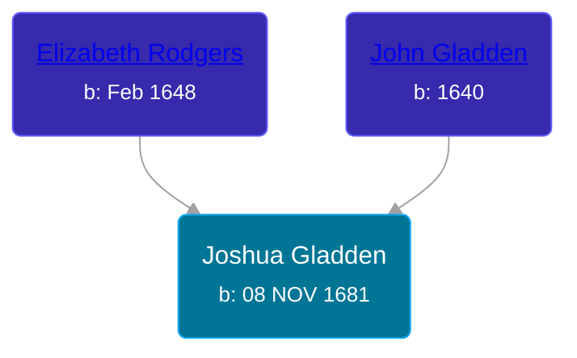

## 🔵 Joshua Gladden

Son of [John Gladden](/people/3/37491986) and [Elizabeth Rodgers](/people/3/38364590)





### 📆 Events


Type | Date | Age at Event | Place
------ | ------ | ------ | ------
Birth | 08 NOV 1681 |  | Bristol, Bristol, Rhode Island, USA



- **Birth**
**Date**: 08 NOV 1681, Age:
**Place**: Bristol, Bristol, Rhode Island, USA


## 👩‍❤️‍👨 Relationships

### 🟣 [Mary Haden](/people/1/19224987), b. 28 SEP 1682

#### Events


Type | Date | Age at Event | Place
------ | ------ | ------ | ------
Marriage | 08 OCT 1713 | 31y, 11m | Saybrook, Middlesex, Connecticut, USA



- **Marriage**
**Date**: 08 OCT 1713, Age: 31y, 11m
**Place**: Saybrook, Middlesex, Connecticut, USA


#### Children With Mary Haden
* 🔵 [Silas Gladding](/people/5/55129348), b. 08 MAY 1730
### 📰 Event Sources

####  Marriage, 08 OCT 1713