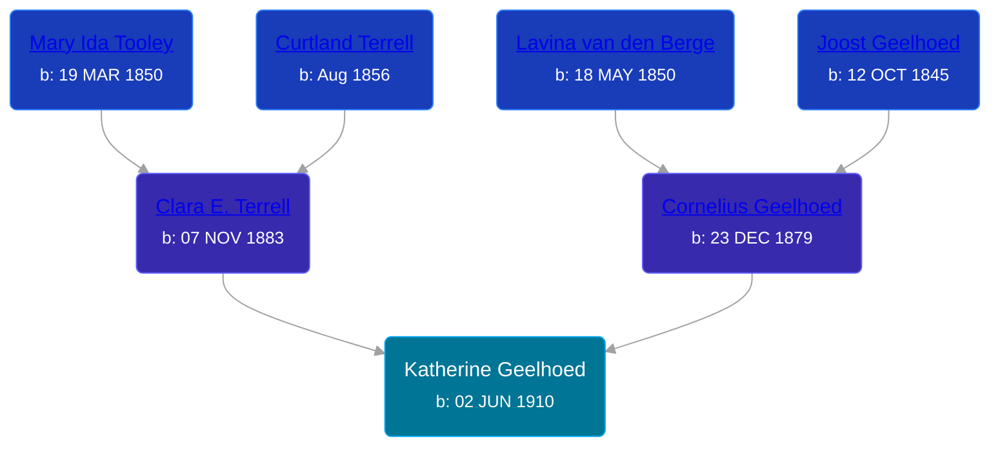

## 🟣 Katherine Geelhoed
<small>Age: 90y, 10m, 21d</small>

Daughter of [Cornelius Geelhoed](/people/9/92844960) and [Clara E. Terrell](/people/6/62490094)





### 📆 Events


Type | Date | Age at Event | Place
------ | ------ | ------ | ------
Birth | 02 JUN 1910 |  | Kent, Michigan, USA
[Residence](#event-event-0) | 1920 | 9y, 5m, 28d | Paris Township, Kent, Michigan, USA
[Death](#event-event-4) | 23 APR 2001 | 90y, 10m, 21d | Lowell, Kent, Michigan, USA
Burial | 26 APR 2001 | 90y, 10m, 24d | Cascade Cemetery



- **Birth**
**Date**: 02 JUN 1910, Age:
**Place**: Kent, Michigan, USA
- **[Residence](#event-event-0)**
**Date**: 1920, Age: 9y, 5m, 28d
**Place**: Paris Township, Kent, Michigan, USA
- **[Death](#event-event-4)**
**Date**: 23 APR 2001, Age: 90y, 10m, 21d
**Place**: Lowell, Kent, Michigan, USA
- **Burial**
**Date**: 26 APR 2001, Age: 90y, 10m, 24d
**Place**: Cascade Cemetery


### 📰 Event Sources

####  Residence, 1920
* 1920 US Census

####  Death, 23 APR 2001
* U.S., Social Security Death Index, 1935-2014
>   
  > Name: KATHERINE FOX  
  > Birth: 02 Jul 1910  
  > Death: 23 Apr 2001 (V)  
  > Last Residence: 49331 (Lowell, Kent, MI)  
  > Last Benefit: (none specified)  
  > SSN: ###-##-####  
  > Issued: Michigan
* The Grand Rapids Press  - 24 Apr 2001
>   
  > FOX -- Katherine Fox, aged 90, of Lowell, formerly of Cascade Township, died Monday, April 23, 2001. She was preceded in death by her husband, Kenneth Fox in 1990. She is survived by her sister, Ella May Thompson of Lowell; brother, Raymond (Loreen) Geelhoed of Lowell; sisters-in-law, Margaret Geelhoed and Phyllis Geelhoed; special friends Dick andBarbara Doezema; many nieces and nephews. Funeral services will be Thursday 11:00 a.m. at Snow United Methodist Church, Rev. Thurlan Meredith, officiating. Interment Cascade Cemetery.
