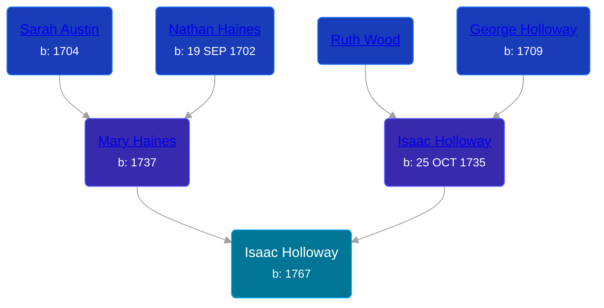

## 🔵 Isaac Holloway
<small>Age: 49y</small>

Son of [Isaac Holloway](/people/9/97947565) and [Mary Haines](/people/5/53194016)





### 📆 Events


Type | Date | Age at Event | Place
------ | ------ | ------ | ------
Birth | 1767 |  |
Death | abt 1816 | 49y |



- **Birth**
**Date**: 1767, Age:
**Place**:
- **Death**
**Date**: abt 1816, Age: 49y
**Place**:


## 👩‍❤️‍👨 Relationships

### 🟣 [Elizabeth Hays](/people/8/83876909)

#### Events


Type | Date | Age at Event | Place
------ | ------ | ------ | ------
Marriage |  |  | Campbell, Virginia, USA



- **Marriage**
**Date**:
**Place**: Campbell, Virginia, USA


#### Children With Elizabeth Hays
* 🔵 [Samuel Holloway](/people/6/61320261), b. about 1801
### 📰 Event Sources

####  Marriage
