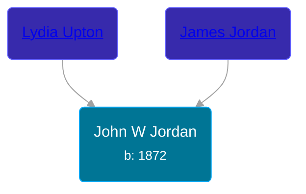

## 🔵 John W Jordan

Son of [James Jordan](/people/8/85897272) and [Lydia Upton](/people/7/79955568)





### 📆 Events


Type | Date | Age at Event | Place
------ | ------ | ------ | ------
Birth | 1872 |  | Kansas, USA
[Residence](#event-event-0) | 13 JUN 1900 | 28y, 6m, 13d | Powhattan, Brown, Kansas, USA
[Residence](#event-event-1) | 27 APR 1910 | 38y, 4m, 27d | Central, Knox, Nebraska, USA



- **Birth**
**Date**: 1872, Age:
**Place**: Kansas, USA
- **[Residence](#event-event-0)**
**Date**: 13 JUN 1900, Age: 28y, 6m, 13d
**Place**: Powhattan, Brown, Kansas, USA
- **[Residence](#event-event-1)**
**Date**: 27 APR 1910, Age: 38y, 4m, 27d
**Place**: Central, Knox, Nebraska, USA


## 👩‍❤️‍👨 Relationships

### 🟣 [Junetta Conger](/people/5/55321016), b. 1872

#### Events


Type | Date | Age at Event | Place
------ | ------ | ------ | ------
[Marriage](#event-family-0-event-0) | 20 JAN 1890 | 18y, 1m, 20d | Paola, Miami, Kansas, USA



- **[Marriage](#event-family-0-event-0)**
**Date**: 20 JAN 1890, Age: 18y, 1m, 20d
**Place**: Paola, Miami, Kansas, USA


#### Children With Junetta Conger
* 🟣 [Maud Jordan](/people/1/13970576), b. Dec 1890
* 🟣 [May Jordan](/people/3/35543563), b. Oct 1892
* 🟣 [Pearl Jordan](/people/9/97019424), b. Jan 1895
* 🔵 [Harvey David Jordan](/people/5/56403502), b. Feb 1898
* 🔵 [Ralph Jordan](/people/4/41726141), b. abt 1902
* 🔵 [William Henry Jordan](/people/3/32091032), b. 10 MAY 1905
* 🟣 [Living Person](/people/4/45230889)
### 📰 Event Sources

####  Marriage, 20 JAN 1890
* The Miami Republican - 24 Jan 1890, page 3
>
  > Justice of the peace S. J. Shively married at his office Monday, J. W. Jordon and Miss Janeta Conger, both of Hillsdale.
* Kansas, County Marriages, 1811-1911
>
  > Name: J.W. Jordan
  > Gender: Male
  > Age: 18
  > Birth Date: 1872
  > Marriage Date: 20 Jan 1890
  > Marriage Place: Paola, Kansas, USA
  > Father: James Jordan
  > Mother: Lydia Upton
  > Spouse: Juneta Conger
  > Spouse Gender: Female
  > Spouse Age: 18
  > Spouse Birth Date: abt 1872
  > Spouse Father: Stephen Conger
  > Spouse Mother: Martha Hendershott
  > Film Number: 001535822
  >

####  Residence, 13 JUN 1900
* 1900 US Census
>
  > Name: John W Jordan
  > Age: 28
  > Birth Date: Jan 1872
  > Birthplace: Kansas, USA
  > Home in 1900: Powhattan, Brown, Kansas
  > Street: Main Street
  > Sheet Number: 11
  > Number of Dwelling in Order of Visitation: 196
  > Family Number: 198
  > Race: White
  > Gender: Male
  > Relation to Head of House: Head
  > Marital Status: Married
  > Spouse's Name: Junetta Jordan
  > Marriage Year: 1890
  > Years Married: 10
  > Father's Birthplace: Indiana, USA
  > Mother's Birthplace: Indiana, USA
  > Occupation: Farmer
  > Months Not Employed: 0
  > Can Read: Y
  > Can Write: Y
  > Can Speak English: Y
  > House Owned or Rented: Rent
  > Farm or House: F
  >
  > Household members:
  > - John W Jordan, 28, Head
  > - Junetta Jordan, 28, Wife
  > - Maud Jordan, 9, Daughter
  > - May Jordan, 7, Daughter
  > - Pearl Jordan, 5, Daughter
  > - Harvey D Jordan, 2, Son
  >

####  Residence, 27 APR 1910
* 1910 US Census
>
  > Name: John Jordan
  > Age in 1910: 39
  > Birth Date: 1871
  > Birthplace: Indiana Territory
  > Home in 1910: Central, Knox, Nebraska, USA
  > Sheet Number: 5b
  > Race: White
  > Gender: Male
  > Relation to Head of House: Head
  > Marital Status: Married
  > Native Tongue: English
  > Occupation: Farmer
  > Employer, Employee or Other: Own Account
  > Home Owned or Rented: Own
  > Home Free or Mortgaged: Free
  > Farm or House: Farm
  > Able to read: Y
  > Able to Write: Y
  > Enumeration District Number: 0113
  > Years Married: 20
  > Enumerated Year: 1910
  >
  > Household members:
  > - John Jordan, 39, Head
  > - Etta Jordan, 38, Wife
  > - May Jordan, 17, Daughter
  > - Pearl Jordan, 15, Daughter
  > - David Jordan, 12, Son
  > - Ralph Jordan, 8, Son
  > - Willie Jordan, 5, Son
  > - Nellie Jordan, 2, Daughter
  >
