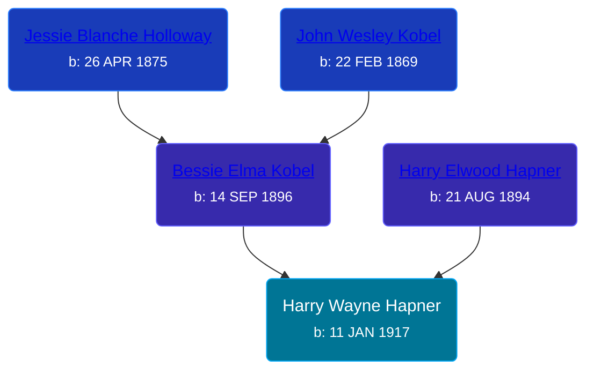

## 🔵 Harry Wayne Hapner
<small>Age: 95y, 2m, 8d</small>

Son of [Harry Elwood Hapner](/people/5/540) and [Bessie Elma Kobel](/people/3/34277096)





### 📆 Events


Type | Date | Age at Event | Place
------ | ------ | ------ | ------
[Birth](#event-event-2) | 11 JAN 1917 |  | Fort Wayne, Allen, Indiana, USA
[Residence](#event-event-0) | 12 JAN 1920 | 3y, 1d | Columbia, Whitley, Indiana, USA
[Residence](#event-event-1) | 1930 | 12y, 10m, 19d | Dorr Township, Allegan, Michigan, USA
[Death](#event-event-5) | 19 MAR 2012 | 95y, 2m, 8d | Grand Rapids, Kent, Michigan, United States



- **[Birth](#event-event-2)**
**Date**: 11 JAN 1917, Age:
**Place**: Fort Wayne, Allen, Indiana, USA
- **[Residence](#event-event-0)**
**Date**: 12 JAN 1920, Age: 3y, 1d
**Place**: Columbia, Whitley, Indiana, USA
- **[Residence](#event-event-1)**
**Date**: 1930, Age: 12y, 10m, 19d
**Place**: Dorr Township, Allegan, Michigan, USA
- **[Death](#event-event-5)**
**Date**: 19 MAR 2012, Age: 95y, 2m, 8d
**Place**: Grand Rapids, Kent, Michigan, United States


## 👩‍❤️‍👨 Relationships

### 🟣 [Ellen Lucille Hanna](/people/8/84629904), b. 13 AUG 1917

#### Children With Ellen Lucille Hanna
* 🟣 [Living Person](/people/6/61459971)
* 🟣 [Living Person](/people/2/28777806)
* 🔵 [Living Person](/people/9/94321954)
### 📰 Event Sources

####  Birth, 11 JAN 1917
* Indiana, Birth Certificates, 1907-1940
>   
  > Name:Harry Wayne Hapner  
  > Gender:Male  
  > Birth Date:11 Jan 1917  
  > Birth Place:Ft Wayne, Allen, Indiana, USA  
  > Registration Year:1917  
  > Father:Harry E. Hapner  
  > Residence: 2102 Smith St  
  > Color: W  
  > Age: 22  
  > Birthplace: So Whitely, Ind  
  > Mother:Bessie A Kobel  
  > Residence: 2102 Smith St  
  > Color: W  
  > Age: 20  
  > Birthplace: Elmira, Michigan  
  > Certificate Number:560  
  > Roll number:001  
  > Agency:Indiana State Dept. of Health  
  > Volume Range:1108 - 1111

####  Residence, 12 JAN 1920
* 1920 US Census

####  Residence, 1930
* 1930 US Census

####  Death, 19 MAR 2012
* U.S., Social Security Death Index, 1935-2014
>   
  > Name:Harry W Hapner  
  > BORN:11 Jan 1917  
  > Died:19 Mar 2012  
  > State (Year) SSN issued:Michigan (Before 1951)
* The Grand Rapids Press  - 25 Mar 2012
>   
  > Together Forever HAPNER, HARRY WAYNE Harry Wayne, age 95 of Grand Rapids, MI passed away peacefully March 19, 2012 and was reunited with his best friend and loving wife of 74 years, Ellen. He is survived by his children Kathleen (Steve) Perry, Kenneth (Sally) Hapner and Judy Sarber, their grandchildren, Scott Hapner, Terry Stroble, Chad (Heidi) Sarber, Lisa (Jason) Monnin, Bryce (Jennifer) Sarber and 10 great grandchildren. Special thanks to Robin, Renee and Shelli. Wayne retired from American Seating Co. after 45 years as a tool and die maker. During their life together Wayne and Ellen shared a love for gardening, fishing, motorcycling, bowling, golfing, square dancing and traveling. They will be deeply missed by family and friends who rejoice in the thought that they are together again. At their request public services will not be held. Arrangements by Cook Family Services, Grandville, 534-7619.