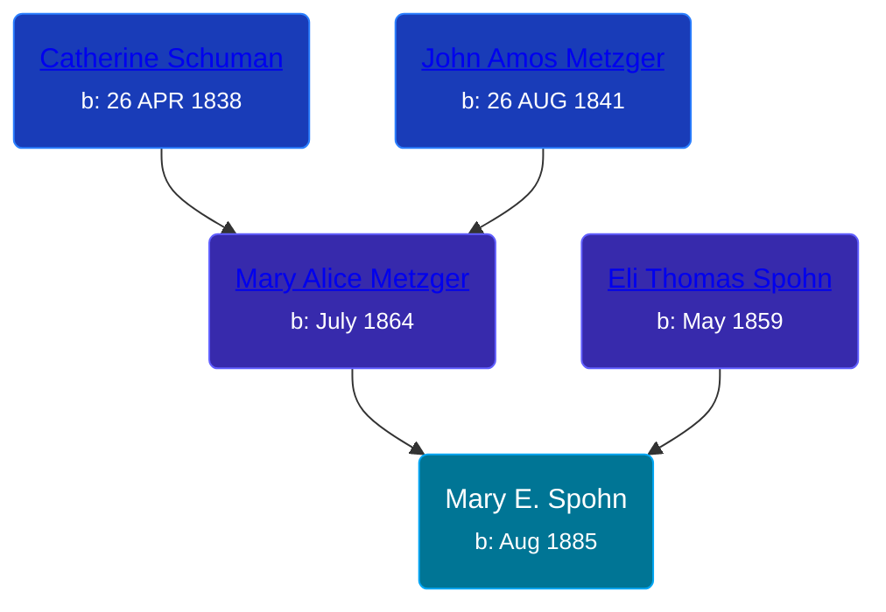

## 🟣 Mary E. Spohn

Daughter of [Eli Thomas Spohn](/people/9/9010973) and [Mary Alice Metzger](/people/3/36824832)





### 📆 Events


Type | Date | Age at Event | Place
------ | ------ | ------ | ------
Birth | Aug 1885 |  | Indiana, USA
[Residence](#event-event-0) | 02 JUN 1900 | 14y, 10m, 2d | Chester Township, Wabash, Indiana, USA



- **Birth**
**Date**: Aug 1885, Age:
**Place**: Indiana, USA
- **[Residence](#event-event-0)**
**Date**: 02 JUN 1900, Age: 14y, 10m, 2d
**Place**: Chester Township, Wabash, Indiana, USA


### 📰 Event Sources

####  Residence, 02 JUN 1900
* 1900 US Census
