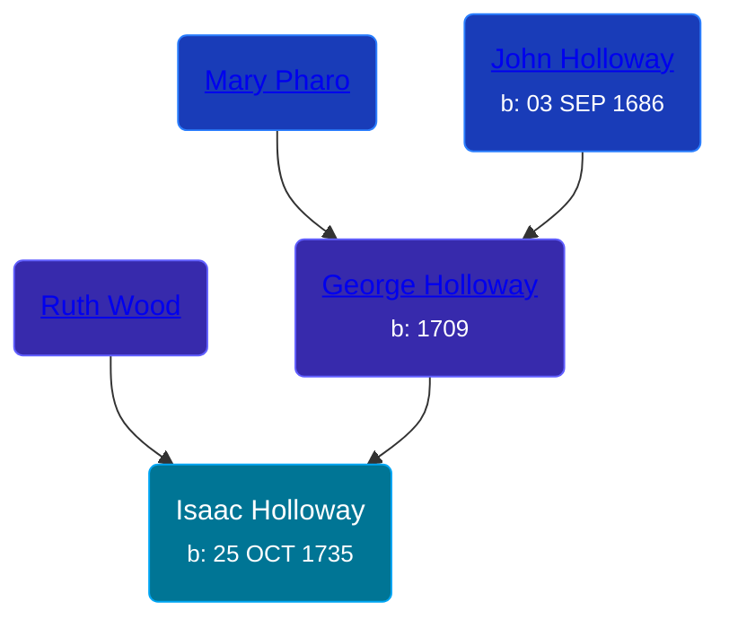

## 🔵 Isaac Holloway
<small>Age: 73y, 1m, 5d</small>

Son of [George Holloway](/people/3/36728768) and [Ruth Wood](/people/9/93045664)





### 📆 Events


Type | Date | Age at Event | Place
------ | ------ | ------ | ------
Birth | 25 OCT 1735 |  | Burlington, New Jersey, USA
Death | 1809 | 73y, 1m, 5d | Stafford, Virginia, USA



- **Birth**
**Date**: 25 OCT 1735, Age:
**Place**: Burlington, New Jersey, USA
- **Death**
**Date**: 1809, Age: 73y, 1m, 5d
**Place**: Stafford, Virginia, USA


## 👩‍❤️‍👨 Relationships

### 🟣 [Mary Haines](/people/5/53194016), b. 1737

#### Events


Type | Date | Age at Event | Place
------ | ------ | ------ | ------
[Marriage](#event-family-0-event-0) | 16 NOV 1758 | 23y, 21d |



- **[Marriage](#event-family-0-event-0)**
**Date**: 16 NOV 1758, Age: 23y, 21d
**Place**:


#### Children With Mary Haines
* 🔵 [Isaac Holloway](/people/9/9759504), b. 1767
### 📰 Event Sources

####  Marriage, 16 NOV 1758
* Ancestry of the Haines, Sharp, Collins, Wills, Gardiner, Prickitt, Eves, Evans, Moore, Troth, Borton and Engle Families.  - 36
