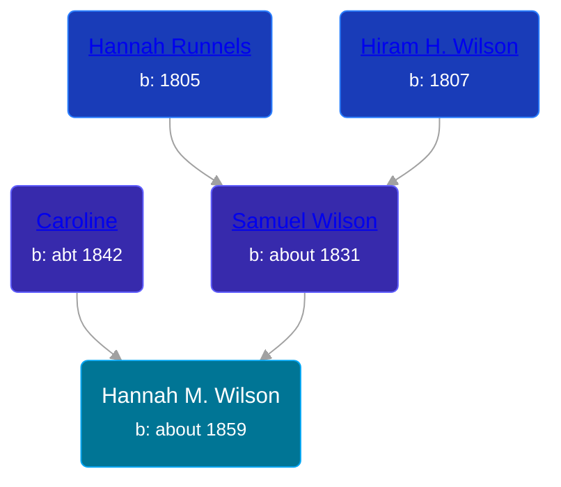

## 🟣 Hannah M. Wilson

Daughter of [Samuel Wilson](/people/2/26563376) and [Caroline ](/people/4/42501514)





### 📆 Events


Type | Date | Age at Event | Place
------ | ------ | ------ | ------
Birth | about 1859 |  | New York, USA
[Residence](#event-event-0) | 16 AUG 1860 | 1y, 8m, 16d | Galen, Wayne, New York, USA



- **Birth**
**Date**: about 1859, Age:
**Place**: New York, USA
- **[Residence](#event-event-0)**
**Date**: 16 AUG 1860, Age: 1y, 8m, 16d
**Place**: Galen, Wayne, New York, USA


### 📰 Event Sources

####  Residence, 16 AUG 1860
* 1860 US Census
>   
  > Name: Hannah M Wilson  
  > Age: 9/12  
  > Birth Year: abt 1859  
  > Gender: Female  
  > Race: White  
  > Birth Place: New York  
  > Home in 1860: Galen, Wayne, New York  
  > Dwelling Number: 921  
  > Family Number: 915  
  >   
  > Household members:  
  > Hiram Wilson, 53  
  > Hannah Wilson, 55  
  > Samuel Wilson, 29  
  > Caroline Wilson, 18  
  > Hannah M Wilson, 9/12  
  >
