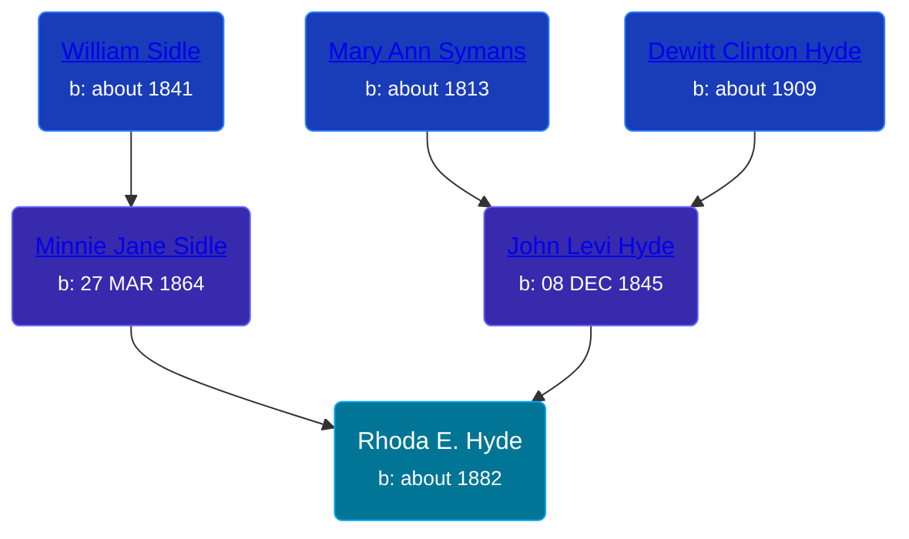

## 🟣 Rhoda E. Hyde

Daughter of [John Levi Hyde](/people/2/23020300) and [Minnie Jane Sidle](/people/7/73883806)





### 📆 Events


Type | Date | Age at Event | Place
------ | ------ | ------ | ------
Birth | about 1882 |  | Newaygo, Michigan, USA
[Residence](#event-event-0) | 1884 | 2y | Grant, Newaygo, Michigan, USA



- **Birth**
**Date**: about 1882, Age:
**Place**: Newaygo, Michigan, USA
- **[Residence](#event-event-0)**
**Date**: 1884, Age: 2y
**Place**: Grant, Newaygo, Michigan, USA


## 👩‍❤️‍👨 Relationships

### 🔵 [Adam Sheaffer](/people/7/75217724), b. about 1874

#### Events


Type | Date | Age at Event | Place
------ | ------ | ------ | ------
[Marriage](#event-family-0-event-0) | 12 MAR 1900 | 18y, 3m, 12d | Grand Rapids, Kent, Michigan, United States



- **[Marriage](#event-family-0-event-0)**
**Date**: 12 MAR 1900, Age: 18y, 3m, 12d
**Place**: Grand Rapids, Kent, Michigan, United States


### 📰 Event Sources

####  Residence, 1884
* 1884 Michigan State Census

####  Marriage, 12 MAR 1900
* Michigan, Marriage Records, 1867-1952
>   
  > Name: Rhoda E Hyde  
  > Gender: Female  
  > Race: White  
  > Age: 18  
  > Birth Year: abt 1882  
  > Birth Place: Newaygo Co, Michigan  
  > Marriage Date: 12 Mar 1900  
  > Marriage Place: Grand Rapids, Kent, Michigan, USA  
  > Residence Place: Ashland Tp, Newaygo Co, Michigan  
  > Father: Levi Hyde  
  > Mother: Minnie Siddle  
  > Spouse: Adam Sheaffer  
  > Gender: Male  
  > Race: White  
  > Age: 26  
  > Birth Year: abt 1874  
  > Birth Place: Montcalm County, Michigan  
  > Residence Place: Grand Rapids, Michigan  
  > Father: Adam Sheaffer  
  > Mother: Seelma Calier  
  > Record Number: 14584