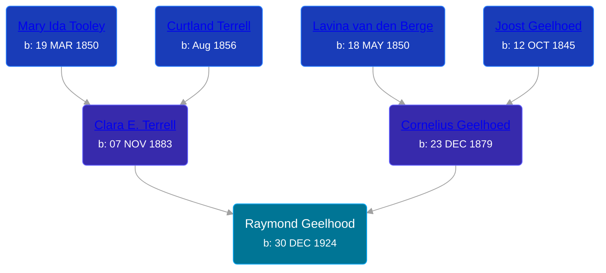

## 🔵 Raymond Geelhood
<small>Age: 78y, 5m, 18d</small>

Son of [Cornelius Geelhoed](/people/9/92844960) and [Clara E. Terrell](/people/6/62490094)





### 📆 Events


Type | Date | Age at Event | Place
------ | ------ | ------ | ------
Birth | 30 DEC 1924 |  | Grand Rapids, Kent, Michigan, United States
[Residence](#event-event-0) | 1930 | 5y, -1m | Cascade, Kent, Michigan, USA
[Residence](#event-event-1) | 12 APR 1940 | 15y, 3m, 12d | Algoma Township, Kent, Michigan, USA
[Death](#event-event-5) | 18 JUN 2003 | 78y, 5m, 18d | Grand Rapids, Kent, Michigan, United States
[Burial](#event-event-6) |  |  | Sarnac Cemetery, Sarnac, Ionia, Michigan, USA



- **Birth**
**Date**: 30 DEC 1924, Age:
**Place**: Grand Rapids, Kent, Michigan, United States
- **[Residence](#event-event-0)**
**Date**: 1930, Age: 5y, -1m
**Place**: Cascade, Kent, Michigan, USA
- **[Residence](#event-event-1)**
**Date**: 12 APR 1940, Age: 15y, 3m, 12d
**Place**: Algoma Township, Kent, Michigan, USA
- **[Death](#event-event-5)**
**Date**: 18 JUN 2003, Age: 78y, 5m, 18d
**Place**: Grand Rapids, Kent, Michigan, United States
- **[Burial](#event-event-6)**
**Date**:
**Place**: Sarnac Cemetery, Sarnac, Ionia, Michigan, USA


### 📰 Event Sources

####  Residence, 1930
* 1930 US Census

####  Residence, 12 APR 1940
* 1940 US Census

####  Death, 18 JUN 2003
* U.S., Social Security Death Index, 1935-2014
>   
  > Name: RAYMOND GEELHOOD  
  > Birth: 30 Dec 1924  
  > Death: 18 Jun 2003 (V)  
  > Last Residence: 49331 (Lowell, Kent, MI)  
  > Last Benefit: (none specified)  
  > SSN: ###-##-####  
  > Issued: Michigan
* The Grand Rapids Press  - 19 Jun 2003, B8
>   
  > GEELHOOD -- Raymond Geelhood, aged 78, of Lowell, passed away June 18, 2003, in Grand Rapids. He was born December 30, 1924 in Grand Rapids, the son of Cornelius and Clara (Terrell) Geelhoed. Raymond married Lillian Sterzick on June 28, 1947 in Saranac. He was an Army veteran of WWII and a past member of V.F.W. of Lowell. He is survived by his loving wife of over 55 years, Lillian Geelhood of Lowell; daughter, Judith (Bradley) Potter of Lowell; sister, Ella Thompson of Lowell; grandchildren, Dawn Potter, Joy (Robert) Milano; great-grandchildren, Robert II and Arielle. He was preceded in death by two brothers and four sisters. Funeral services will be held 11:00 a.m. Saturday, June 21, 2003 at Lake Funeral Home in Saranac, with Rev. John Madvig officiating. Interment Saranac Cemetery. Visitation will be held Friday from 2 to 4 and 7 to 8:30 p.m. at the funeral home. Anyone wishing may make on-line condolences at www.lakefuneralhomes.com

####  Burial
* findagrave.com
>   
  > Raymond Geelhood  
  > TEC 5 US Army  
  > World War II  
  > b: Dec 30, 1924; d: Jun 18, 2003  
  >   
  > Otherside:  
  > Geelhood, Raymond L  
  > b: 1924; d: 2003  
  >   
  > Geelhood, L. Lorene  
  > b: 1918; d: 2008
* U.S. Veterans Gravesites, ca.1775-2006
>   
  > Name: Raymond Geelhood  
  > Service Info.: TEC 5 US ARMY WORLD WAR II  
  > Birth Date: 30 Dec 1924  
  > Death Date: 18 Jun 2003  
  > Cemetery: Saranac Cemetery  
  > Cemetery Address: Saranac, MI 48881
