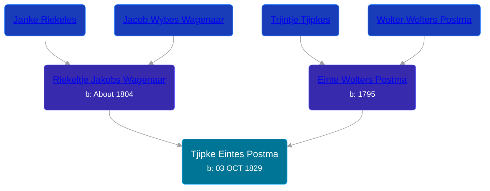

## 🔵 Tjipke Eintes Postma

Son of [Einte Wolters Postma](/people/1/18880768) and [Riekeltje Jakobs Wagenaar](/people/7/77820694)





### 📆 Events


Type | Date | Age at Event | Place
------ | ------ | ------ | ------
[Birth](#event-event-2) | 03 OCT 1829 |  | Netherlands



- **[Birth](#event-event-2)**
**Date**: 03 OCT 1829, Age:
**Place**: Netherlands


## 👩‍❤️‍👨 Relationships

### 🟣 [Akke Jans Hayema](/people/8/83341373), b. abt 1820

#### Events


Type | Date | Age at Event | Place
------ | ------ | ------ | ------
[Marriage](#event-family-0-event-0) | 15 MAY 1856 | 26y, 7m, 12d | Achtkarspelen, Netherlands



- **[Marriage](#event-family-0-event-0)**
**Date**: 15 MAY 1856, Age: 26y, 7m, 12d
**Place**: Achtkarspelen, Netherlands


### 📰 Event Sources

####  Birth, 03 OCT 1829
* Dutch Civil Register
>   
  > Source Civil register - Birth  
  >   
  > Archive location: Tresoar, Frysk Histoarysk en Letterkundich Sintrum  
  > General Municipality: Achtkarspelen  
  > Type of record: Geboorteakte  
  > Record number: B 75  
  > Registration date: 05-10-1829  
  > Child: Tjipke Eints Postma  
  > Gender: M  
  > Date of birth: 03-10-1829  
  > Father: Eint Wolter Postma  
  > Mother: Riekeltje Jakobs Wagenaar
####  Marriage, 15 MAY 1856
* Dutch Civil Register
>   
  > Source Civil register - Marriage  
  > Archive location: Tresoar, Frysk Histoarysk en Letterkundich Sintrum  
  > General Number of finding aid: 30-01  
  > Item number: 2017  
  > Municipality: Achtkarspelen  
  > Type of record: Huwelijksakte  
  > Record number: 25  
  > Registration date: 15-05-1856  
  > Bridegroom: Tjipke Eintes Postma  
  > Age: 26  
  > Place of birth: Surhuisterveen  
  > Bride: Akke Jans Hayema  
  > Age: 36  
  > Place of birth: Surhuisterveen  
  > Father bridegroom: Einte Wolters Postma  
  > Mother bridegroom: Riekeltje Jakobs Wagenaar  
  > Father bride: Jan Durks Hayema  
  > Mother bride: Antje Durks Smits
