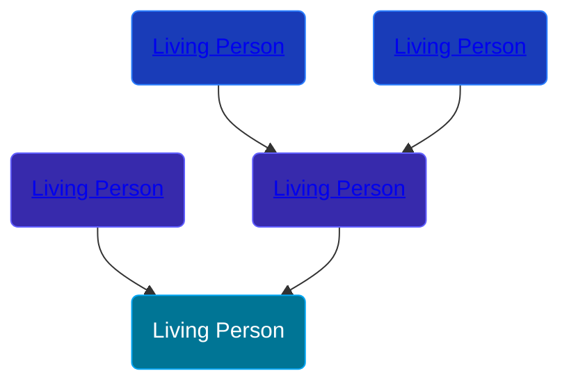

## 🔵 Living Person

Son of [Living Person](/people/3/315988) and [Living Person](/people/1/16926442)



```mermaid
graph
classDef grands fill:#193cb8,stroke:#2b7fff,stroke-width:1px,color:#fff;
classDef parents fill:#372aac,stroke:#615fff,stroke-width:1px,color:#fff;
classDef primary fill:#007595,stroke:#00a6f4,stroke-width:1px,color:#fff;
98692772(Living Person):::primary
16926442(<a class="text-white" href="/people/1/16926442">Living Person</a>):::parents-->98692772
315988(<a class="text-white" href="/people/3/315988">Living Person</a>):::parents-->98692772
91180844(<a class="text-white" href="/people/9/91180844">Living Person</a>):::grands-->315988
84637541(<a class="text-white" href="/people/8/84637541">Living Person</a>):::grands-->315988
```

