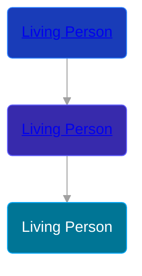

## 🔵 Living Person

Son of [Living Person](/people/2/20123685)



```mermaid
graph
classDef grands fill:#193cb8,stroke:#2b7fff,stroke-width:1px,color:#fff;
classDef parents fill:#372aac,stroke:#615fff,stroke-width:1px,color:#fff;
classDef primary fill:#007595,stroke:#00a6f4,stroke-width:1px,color:#fff;
98903698(Living Person):::primary
20123685(<a class="text-white" href="/people/2/20123685">Living Person</a>):::parents-->98903698
87147493(<a class="text-white" href="/people/8/87147493">Living Person</a>):::grands-->20123685
linkStyle default stroke:#a1a1a1
```

