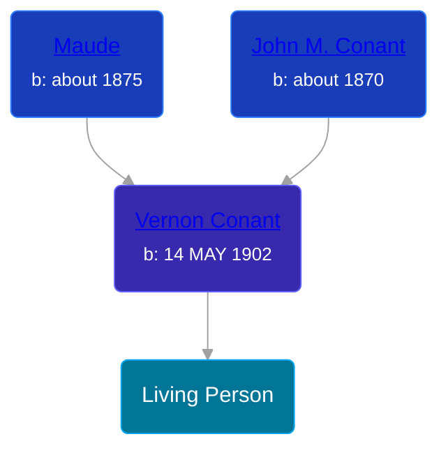

## 🔵 Living Person

Son of [Vernon Conant](/people/1/15985527)



```mermaid
graph
classDef grands fill:#193cb8,stroke:#2b7fff,stroke-width:1px,color:#fff;
classDef parents fill:#372aac,stroke:#615fff,stroke-width:1px,color:#fff;
classDef primary fill:#007595,stroke:#00a6f4,stroke-width:1px,color:#fff;
98925772(Living Person):::primary
15985527(<a class="text-white" href="/people/1/15985527">Vernon Conant</a><br /><small>b: 14 MAY 1902</small>):::parents-->98925772
58402932(<a class="text-white" href="/people/5/58402932">Maude </a><br /><small>b: about 1875</small>):::grands-->15985527
38989658(<a class="text-white" href="/people/3/38989658">John M. Conant</a><br /><small>b: about 1870</small>):::grands-->15985527
linkStyle default stroke:#a1a1a1
```


## 👩â€â¤ï¸â€ğŸ‘¨ Relationships

### 🟣 [Living Person](/people/7/74985733)
