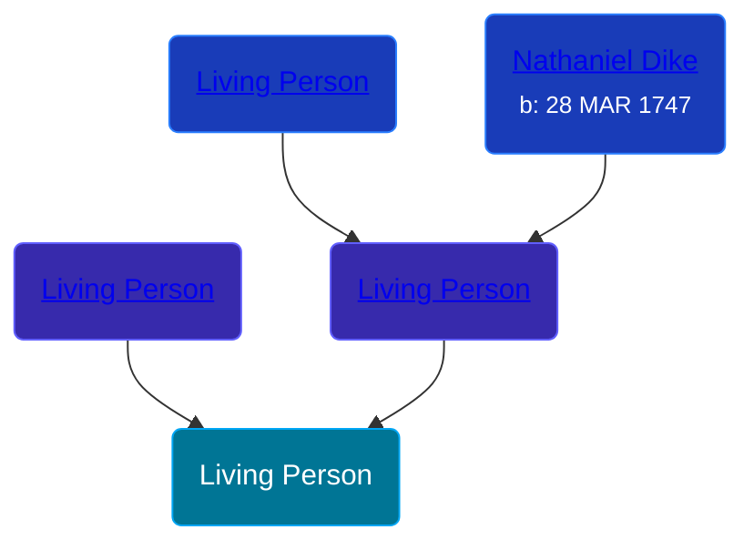

## 🔵 Living Person

Son of [Living Person](/people/3/3859108) and [Living Person](/people/4/42020904)



```mermaid
graph
classDef grands fill:#193cb8,stroke:#2b7fff,stroke-width:1px,color:#fff;
classDef parents fill:#372aac,stroke:#615fff,stroke-width:1px,color:#fff;
classDef primary fill:#007595,stroke:#00a6f4,stroke-width:1px,color:#fff;
99016950(Living Person):::primary
42020904(<a class="text-white" href="/people/4/42020904">Living Person</a>):::parents-->99016950
3859108(<a class="text-white" href="/people/3/3859108">Living Person</a>):::parents-->99016950
66432130(<a class="text-white" href="/people/6/66432130">Living Person</a>):::grands-->3859108
36914917(<a class="text-white" href="/people/3/36914917">Nathaniel Dike</a><br /><small>b: 28 MAR 1747</small>):::grands-->3859108
```


## 👩â€â¤ï¸â€ğŸ‘¨ Relationships

### 🟣 [Living Person](/people/5/56179916)
