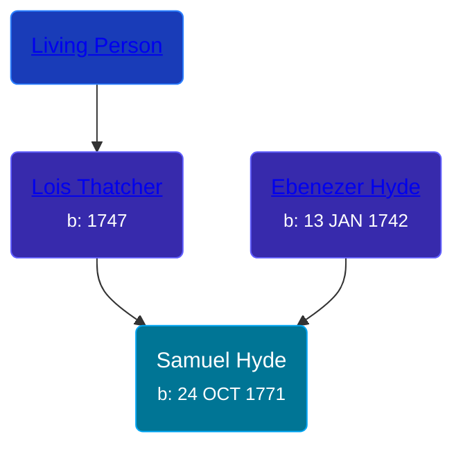

## 🔵 Samuel Hyde
<small>Age: 48y, 5m, 17d</small>

Son of [Ebenezer Hyde](/people/1/14535025) and [Lois Thatcher](/people/9/92113144)





### 📆 Events


Type | Date | Age at Event | Place
------ | ------ | ------ | ------
[Birth](#event-event-2) | 24 OCT 1771 |  | Hartford, Connecticut, USA
[Death](#event-event-3) | 11 APR 1820 | 48y, 5m, 17d |



- **[Birth](#event-event-2)**
**Date**: 24 OCT 1771, Age:
**Place**: Hartford, Connecticut, USA
- **[Death](#event-event-3)**
**Date**: 11 APR 1820, Age: 48y, 5m, 17d
**Place**:


## 👩‍❤️‍👨 Relationships

### 🟣 [Freelove Clark](/people/9/92731294), b. 07 JAN 1778

#### Events


Type | Date | Age at Event | Place
------ | ------ | ------ | ------
[Marriage](#event-family-0-event-0) | 27 FEB 1794 | 22y, 4m, 3d |



- **[Marriage](#event-family-0-event-0)**
**Date**: 27 FEB 1794, Age: 22y, 4m, 3d
**Place**:


### 📰 Event Sources

####  Birth, 24 OCT 1771
* A History of the Town of Poultney, Vermont
* The Hyde Ancestors of Lawrence Hyde, 1888-1960

####  Marriage, 27 FEB 1794
* A History of the Town of Poultney, Vermont
####  Death, 11 APR 1820
* The Hyde Ancestors of Lawrence Hyde, 1888-1960
* A History of the Town of Poultney, Vermont
