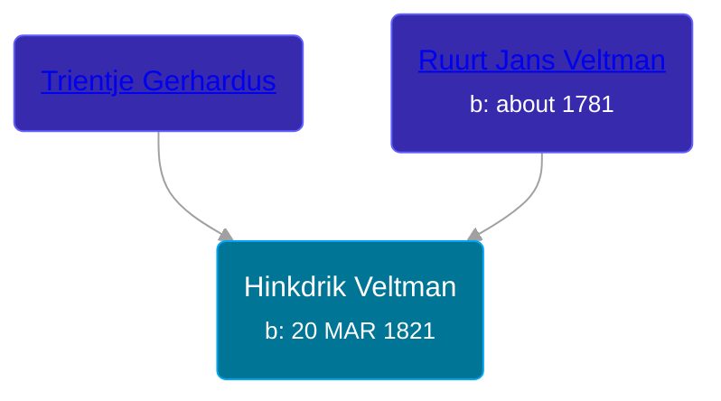

## 🔵 Hinkdrik Veltman

Son of [Ruurt Jans Veltman](/people/5/53462276) and [Trientje Gerhardus](/people/5/5258118)





### 📆 Events


Type | Date | Age at Event | Place
------ | ------ | ------ | ------
[Birth](#event-event-2) | 20 MAR 1821 |  | Tolbert, Netherlands



- **[Birth](#event-event-2)**
**Date**: 20 MAR 1821, Age:
**Place**: Tolbert, Netherlands


### 📰 Event Sources

####  Birth, 20 MAR 1821
* Dutch Civil Register
>   
  > Child: Hindrik Veltman  
  > Birth date: 20-03-1821  
  > Place of birth: Tolbert gem. Leek  
  > Gender: Man  
  >   
  > Father: Ruurt Jans Veltman  
  > Profession: arbeider  
  > Age: 39 jaar  
  >   
  > Mother: Trientje Gerardus  
  > Age: 32 jaar  
  >   
  > Event: Geboorte  
  > Event date: 20-03-1821  
  > Event place: Tolbert gem. Leek  
  >   
  > Document type: BS Geboorte  
  > Heritage institution: Groninger Archieven  
  > Institution place: Groningen  
  > Collection region: Groningen  
  > Source number: 36  
  > Registration date: 23-03-1821  
  > Document place: Leek  
  > Collection: Bron: boek, Periode: 1821  
  > Book: Geboorteregister 1821  
  >