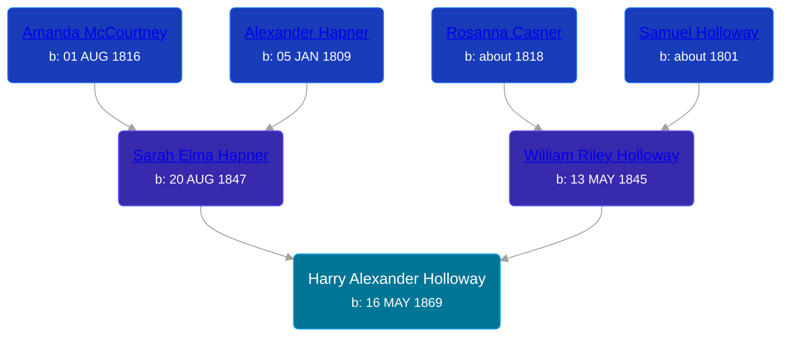

## 🔵 Harry Alexander Holloway
<small>Age: 83y, 5m, 13d</small>

Son of [William Riley Holloway](/people/9/90949012) and [Sarah Elma Hapner](/people/2/20173654)





### 📆 Events


Type | Date | Age at Event | Place
------ | ------ | ------ | ------
[Birth](#event-event-2) | 16 MAY 1869 |  | Union Township, Isabella, Michigan, USA
[Residence](#event-event-0) | 01 JUL 1870 | 1y, 1m, 15d | Union Township, Isabella, Michigan, USA
[Residence](#event-event-1) | June 1880 | 11y, 14d | Chippewa Township, Isabella, Michigan, USA
[Death](#event-event-5) | 29 OCT 1952 | 83y, 5m, 13d | Seattle, Kings, Washington, USA



- **[Birth](#event-event-2)**
**Date**: 16 MAY 1869, Age:
**Place**: Union Township, Isabella, Michigan, USA
- **[Residence](#event-event-0)**
**Date**: 01 JUL 1870, Age: 1y, 1m, 15d
**Place**: Union Township, Isabella, Michigan, USA
- **[Residence](#event-event-1)**
**Date**: June 1880, Age: 11y, 14d
**Place**: Chippewa Township, Isabella, Michigan, USA
- **[Death](#event-event-5)**
**Date**: 29 OCT 1952, Age: 83y, 5m, 13d
**Place**: Seattle, Kings, Washington, USA


### 📰 Event Sources

####  Birth, 16 MAY 1869
* Michigan, Births and Christenings Index, 1867-1911
>   
  > Name: Harry A Hollaway  
  > Gender: Male  
  > Birth Place: Union Twp, Isabella, Michigan  
  > Birth Date: 16 May 1869  
  > Father's name: William Riley Hollaway  
  > Mother's name: Sarah Elma Hapner  
  > FHL Film Number: 1005117

####  Residence, 01 JUL 1870
* 1870 US Census

####  Residence, June 1880
* 1880 US Census

####  Death, 29 OCT 1952
* Washington, Deaths, 1883-1960
>   
  > Name: Harry Alexander Holloway  
  > Gender: Male  
  > Birth Date: abt 1869  
  > Death Date: 29 Oct 1952  
  > Age at Death: 83  
  > Death Location: Seattle, King, Washington  
  > Father: William Holloway  
  > Mother: Sarah Hapner  
  > Record Source: Washington State Death Records
* Washington, Death Index, 1940-2014
>   
  > Name: Harry A Holloway  
  > Gender: Male  
  > Age: 83  
  > Birth Year: abt 1869  
  > Death Date: 29 Oct 1952  
  > Death Place: Washington, USA  
  > Certificate Number: 19223