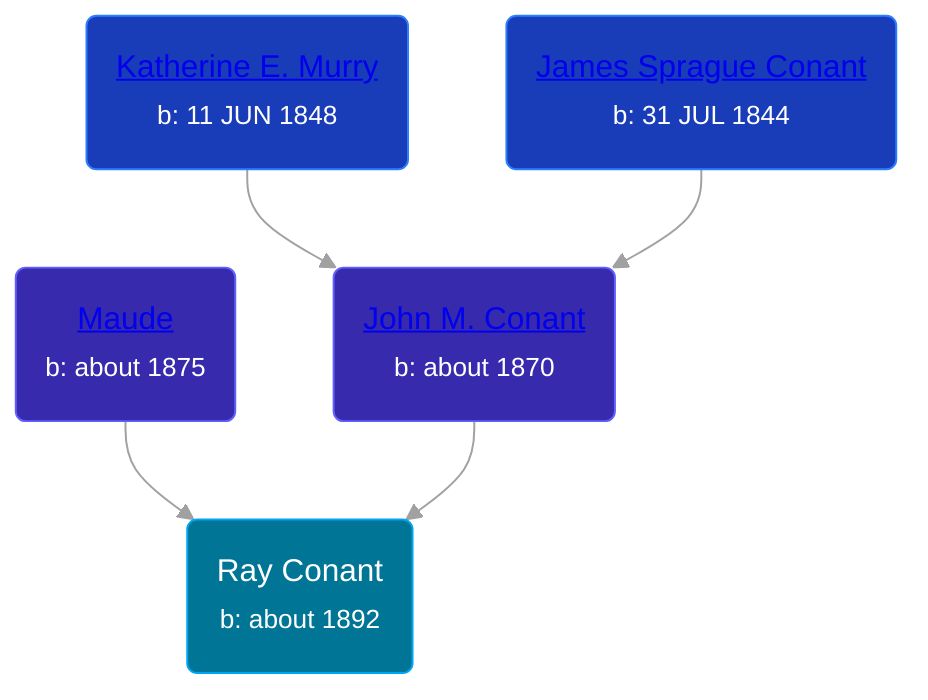

## 🔵 Ray Conant
<small>Age: 1y, 5m, 2d</small>

Son of [John M. Conant](/people/3/38989658) and [Maude ](/people/5/58402932)





### 📆 Events


Type | Date | Age at Event | Place
------ | ------ | ------ | ------
Birth | about 1892 |  | Michigan, USA
[Death](#event-event-3) | 02 MAY 1893 | 1y, 5m, 2d | Robinson Township, Ottawa, Michigan, USA



- **Birth**
**Date**: about 1892, Age:
**Place**: Michigan, USA
- **[Death](#event-event-3)**
**Date**: 02 MAY 1893, Age: 1y, 5m, 2d
**Place**: Robinson Township, Ottawa, Michigan, USA


### 📰 Event Sources

####  Death, 02 MAY 1893
* Ottawa County Death Records
>   
  > Name: Conant, Ray  
  > Date of Death: 2 MAY 1893  
  > Sex: M  
  > Marital Status: S  
  > Age: 7M 18D  
  > Death Place: Robinson  
  > Cause: Lung  
  > Birthplace: MI  
  > Father: John Conant  
  > Mother: Maud
